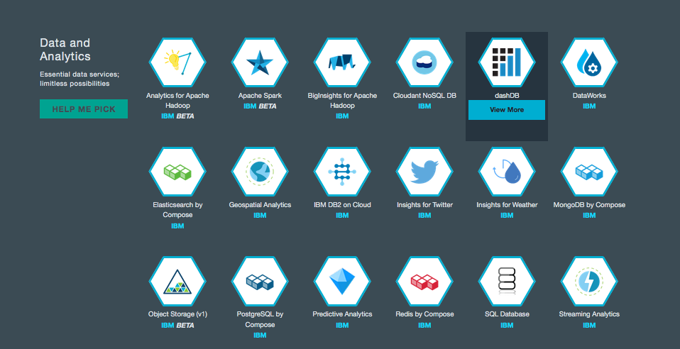
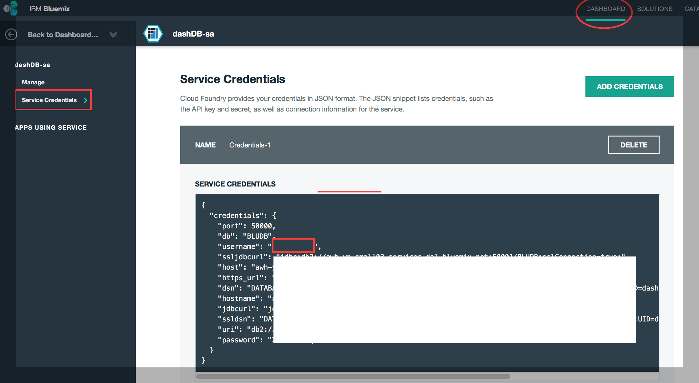
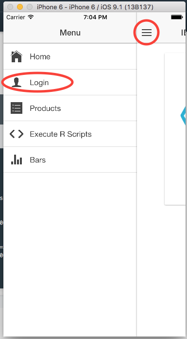

# IBM Bluemix dashDB + Ionic Mobile App Sample

This sample mobile app leverages IBM's Bluemix dashDB REST API. The sample code contains an example of how to issue SQL queries to dashDB and retrieve data to display. It also executes R Scripts and retrieves the graph images generated by the R scripts.

## Let's set it up!

(Instructions written for mac users)

- Download the latest version of NodeJS at https://nodejs.org/en/

- Once you have installed NodeJS and NPM successfully, install the ionic npm by issuing the following command in your terminal: `sudo npm install -g ionic`

- cd/navigate to where you cloned this git repo and cd to the dmobile directory: `/dashdb_mobile/dmobile`

- run `ionic platform ios android`

- if you would like to use Google Chrome Browser as an emulator run `ionic serve` and open Chrome to this URL: `http://localhost:8100/`. Use Chrome's Developer Tools and Toggle device mode.

- You can also run the super fast ios emulator by issuing the following commands: `ionic build ios`  followed by `ionic run ios`

- You can also run this on the android emulator or device by issuing the following commands: `ionic build android` followed by `ionic run android` (if you have an android device with developer mode enabled and the necessary android SDK APIs, you can plug it into your computer and ionic will install the app in the device when running `ionic run android`)

## Get a dashDB Instance in Bluemix!

- Go to Bluemix.net and sign up!

- To create a dashDB Instance, go to the Catalog. 

- Click on dashDB Service Icon, under the category Data and Analytics. 
	

- Once you have created your instance. You will need the host, username and password to access your data from the mobile app. You can see your credentials by going to the DASHBOARD and clicking on your dashDB instance. On the left menu, click on Service Credentials.
	

## Connect the mobile app to your dashDB instance

Now that you have your dashDB credentials, click on the Login button in the mobile app menu and enter your credentials.

